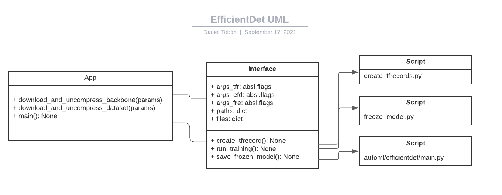

# Efficientdet Repositorio Refactorizado
Repositorio refactorizado del AITeam para el trabajo y desarrollo de una CNN basada en el modelo del EfficientDet de Google: [efficientdet-google](https://github.com/google/automl)

## Descripción
Este proyecto se basa en un patrón de diseño estructural Facade que permite ocultar la complejidad interna del proyecto [efficientdet-google](https://github.com/google/automl) y expone una interfaz simplificada de uso para el pipeline de entrenamiento, evaluación y manejo de datasets.

Este proyecto utiliza Tensorflow 2.5 y Python 3.8.

Tensorflow 2 requiere CPU con soporte AVX

Pipeline:

1. Conversión dataset de imágenes/labels a formato *TFRecord*
2. Entrenamiento 
3. Conversión modelo entrenado a FrozenModel

**Nota:**
Se recomienda el uso de entorno virtual conda/venv para el manejo de la instalación de paquetes




# TODO
- Revisar el metodo de creación de tfrecord para train y val por separado
- Revisar el metodo de división de dataset en train y val
- Revisar el parametro `augmix` del `perc_split_training` (no aparece en el nuevo `automl-efficientdet`)
- Hace falta desarrollar manejo de excepciones, ya sea por parametro mal proporcionado o no encontrado
- Revisar parametros que no son seteables por line de commando: `gcp_project`, `eval_timeout`, `strategy`
- Revisar el tamaño generado por cada TFRecord, se recomienda minimo 10MB por tfrecord
- Revisar el manejo de variables de entorno
- Remover workspace despues de cada sesion

# Repositorio Estado Actual
- Actualmente, este repositorio permite la ejecución de un entrenamiento forajido sin tfrecords de evaluación. Se puede evaluar el modelo seleccionando el modo `train_and_eval` o con el parametro `eval_after_train`, pero al no tener tfrecord de validación intregado en el pipeline, no se puede garantizar la veracidad del mismo. 

## Getting started
Se debe clonar el repositorio de manera **recursiva** para descargar los archivos correspondientes al submodulo [efficientdet-google-fork-version](https://git-codecommit.us-east-1.amazonaws.com/v1/repos/automl)
```
git clone --recursive https://git-codecommit.us-east-1.amazonaws.com/v1/repos/aituring_pipeline_efficientdet
```

## Requisitos

### Windows
- Microsoft C++ Build Tools: [link here](https://visualstudio.microsoft.com/visual-cpp-build-tools)
- wget: [link here](https://eternallybored.org/misc/wget/)
- tee: [link here](https://www.pconlife.com/viewfileinfo/tee-exe/)
- Agregar a las variables de entorno (opcional) (si se usa miniconda3):

	- `C:\Users\USER-NAME\miniconda3\Scripts`
	- `C:\Users\USER-NAME\miniconda3\Library\bin`

**Note:**
Se debe agregar el path del folder en donde está *wget* y *tee* a las variables de entorno de windows


### Linux
- gcc >= 9.3.0


## Instalación
Se recomienda el uso de un entorno aislado para la instalación de paquetes. Para este repositorio se utilizó [miniconda](https://docs.conda.io/en/latest/miniconda.html)

```
conda config --set auto_activate_base false
conda config --set env_prompt '({name})
```

### Instalación con conda
```
conda create --prefix=conda-env python=3.8.10
conda activate conda-env/
conda install tensorflow=2.5
conda install tensorflow-model-optimization=0.6 -c hcc
conda install lxml=4.6
conda install pycocotools=2.0.2
conda install opencv=4.5 -c conda-forge
conda install pyyaml=5.4 -c conda-forge
conda install configparser=5.0 -c conda-forge
```

### Instalación con PIP
```
conda create --prefix=conda-env python=3.8
pip install -r requirements.txt
```
**Nota:**
Conda también permite la carga de paquetes desde un archivo de requerimientos utilizando el comando:

`conda install --file requirements.txt`

## Parametros
Este repositorio admite parametros de 3 maneras:

1. parametros por linea de comando:
```
python3 main.py 
--mode=train_and_eval 
--train_file_pattern=/path/to/train.tfrecord
--eval_file_pattern=/path/to/eval.tfrecord
--model_name=efficientdet-d0 
--model_dir=/path/to/output/folder 
--backbone_ckpt=/path/to/downloaded/backbone/checkpoint
--train_batch_size=1
--eval_batch_size=1
--num_epochs=10 
--hparams=/path/to/train_tfrecord_config.yaml
--num_examples_per_epoch=10
```
**Nota:**
Para una lista completa de argumentos por linea de comando
```
python3 main.py [-h/--help]    version corta
python3 main.py [--helpfull]   version completa
```
2. parametros por archivo de configuración:

Esta opción permite la carga de argumentos desde un archivo externo. No hay preferencia en el tipo de archivo, puede ser .txt, .config, .ini, etc. La estructura del archivo es la siguiente:
```
--URL_DATASET=/path/to/S3/dataset.zip
--BACKBONE_REF=efficientdet-d#
--NUM_EPOCHS=100
--TRAIN_BATCH_SIZE=1
--EVAL_BATCH_SIZE=1
--MODEL_CKPTS=/path/to/output/folder
--NUM_EXAMPLES_PER_EPOCH=4455
```
Para cargar el archivo se indica con una `@` el nombre del archivo
```
python3 main.py @[archivo de configuración]
e.g.
python3 main.py @params.config
```
3. parametros por variables de entorno:

Se debe setear variables de entorno con los argumentos mostrados en el punto 2.


## Test
Los siguientes ejemplos muestran las 3 formas de ejecutar el pipeline.
```
Training with command line parameters
-------
python3 main.py --URL_DATASET https://datasets-aiteam.s3.amazonaws.com/DATASET-5-FOTOS.zip \
--BATCH_SIZE 1 \
--BACKBONE_REF efficientdet-d0 \
--NUM_EPOCHS 5 \
--MODEL_CKPTS efficientdet-d0-output-folder


Training with environment variables    
-------
export URL_DATASET=https://datasets-aiteam.s3.amazonaws.com/DATASET-5-FOTOS.zip
export BATCH_SIZE=1
export BACKBONE_REF=efficientdet-d0
export NUM_EPOCHS=5
export MODEL_CKPTS=efficientdet-d0-Output-folder
python3 main.py 


Training with configuration file    
-------
python3 main.py @params.config
```

## TFRecords
Actualmente este script convierte un directorio de imagénes (dataset) en el formato de AITuring (PASCAL VOC) a tfrecord. El nuevo submodulo de `automl/efficientdet` no tiene como argumento `data_augmentation`. En su lugar, tiene un argumento de `autoaugment_policy` que se puede setear a `randaug`. En cuanto al parametro de `split_data` que está en el script, actualmente no se ha probado si divide de manera correcta la lista de las rutas de las imagénes en train and validation, ya que el tfrecord name generado por este script no genera archivos independientes.
```
python3 tfRecordMod/create_tfrecords.py --data_dir=$temp_dir_dataset \
--output_path=$temp_dir_tfrecords/train_tfrecord \
--num_shards=10 \
--use_data_augmentation=True  \
--perc_split_training=1.0
```
## Training
Este script permite ejecutar un entrenamiento forajido. Por favor, remitirse a la sección `Training with command line parameters` para una lista completa de argumentos.  
```
python3 automl/efficientdet/main.py --mode=train \
--training_file_pattern=$temp_dir_tfrecords/train_tfrecord*.tfrecord \
--model_name=$BACKBONE_REF \
--model_dir=/workspace/saved_checkpoints/$MODEL_CKPTS \
--backbone_ckpt=/workspace/ckpts/$BACKBONE_REF \
--train_batch_size=$BATCH_SIZE \
--num_epochs=$NUM_EPOCHS \
--hparams=$temp_dir_tfrecords/train_tfrecord_config.yaml \
--num_examples_per_epoch=4455
```

## Eval
cooming soon...

## Frozen model
```
python3 freezeModelMod/freeze_aituring.py --path_ckpt /workspace/saved_checkpoints/$MODEL_CKPTS \
--path_yaml $temp_dir_tfrecords/train_tfrecord_config.yaml \
--path_output /workspace/saved_checkpoints/$MODEL_CKPTS$prefix_freeze \
--model_name $BACKBONE_REF
```

## Inference
coming soon...

## troubleshoot
En este sección se presentan algunos errores de instalación y/o ejecución del pipeline y su correspondiente solución.
```
Error: pip install tensorflow cannot find file called xxx.h
Solution: Follow the instructions to update your registry for MAX_PATH, changing it from 0 to 1 in Windows.
Your administrator will need to activate the “Enable Win32 long paths” group policy, or set LongPathsEnabled to 1 in the registry key HKEY_LOCAL_MACHINE\SYSTEM\CurrentControlSet\Control\FileSystem. 
https://docs.python.org/3/using/windows.html

Error: wget is not recognized as an internal or external command
Solution: Download and install wget on Windows

Error: Illegal instruction (core dumped) after running import tensorflow
Solution: tensorflow 2 only works on a CPU with AVX support, you will need to use tensorflow conda instead of pip or compile your own from source code with AVX support disabled

Error: no module xxx found
Solution: pip install xxx

Error: ParserError the splatting operator '@' cannot be used to reference variables in an expression. '@params' can be used only as an argument to a command.
Solution: quote the whole argument e.g python3 main.py '@params.config'

Error: tee is not recognized as an internal or external command
Solution: download and install tee on windows, https://sourceforge.net/projects/unxutils/
```

